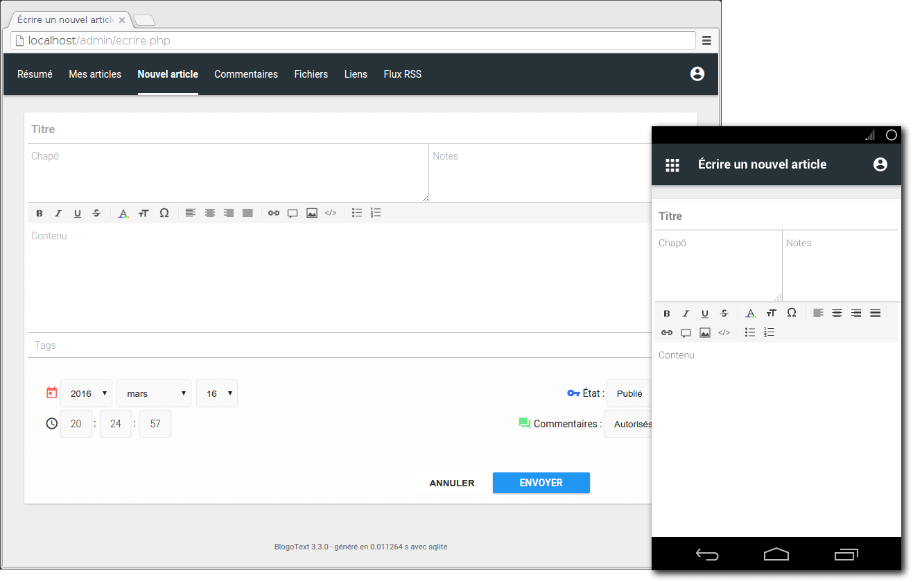

<!--
Nota bene : ce README est automatiquement généré par <https://github.com/YunoHost/apps/tree/master/tools/readme_generator>
Il NE doit PAS être modifié à la main.
-->

# BlogoText pour YunoHost

[](https://ci-apps.yunohost.org/ci/apps/blogotext/)


[](https://install-app.yunohost.org/?app=blogotext)

*[Lire le README dans d'autres langues.](./ALL_README.md)*

> *Ce package vous permet d’installer BlogoText rapidement et simplement sur un serveur YunoHost.*  
> *Si vous n’avez pas YunoHost, consultez [ce guide](https://yunohost.org/install) pour savoir comment l’installer et en profiter.*

## Vue d’ensemble

BlogoText est un moteur de blog léger.

### Caractéristiques

- Blog avec commentaires et flux RSS
- Partage de liens
- Lecteur RSS
- Téléchargement et partage d'images/fichiers
- Import-export JSON/ZIP/HTML ; Importation WordPress
- Modules complémentaires de support


**Version incluse :** 3.7.6~ynh7

**Démo :** <https://blogotext.org/blog/>

## Captures d’écran



## :red_circle: Anti-fonctionnalités

- **Application non maintenue **: Ce logiciel n'est plus maintenu. Attendez-vous à ce qu'il ne fonctionne plus avec le temps, et que l'on découvre des failles de sécurité qui ne seront pas corrigées, etc.

## Documentations et ressources

- Site officiel de l’app : <https://blogotext.org/>
- Documentation officielle de l’admin : <https://github.com/BlogoText/blogotext/wiki>
- Dépôt de code officiel de l’app : <https://github.com/BlogoText/blogotext>
- YunoHost Store : <https://apps.yunohost.org/app/blogotext>
- Signaler un bug : <https://github.com/YunoHost-Apps/blogotext_ynh/issues>

## Informations pour les développeurs

Merci de faire vos pull request sur la [branche `testing`](https://github.com/YunoHost-Apps/blogotext_ynh/tree/testing).

Pour essayer la branche `testing`, procédez comme suit :

```bash
sudo yunohost app install https://github.com/YunoHost-Apps/blogotext_ynh/tree/testing --debug
ou
sudo yunohost app upgrade blogotext -u https://github.com/YunoHost-Apps/blogotext_ynh/tree/testing --debug
```

**Plus d’infos sur le packaging d’applications :** <https://yunohost.org/packaging_apps>
