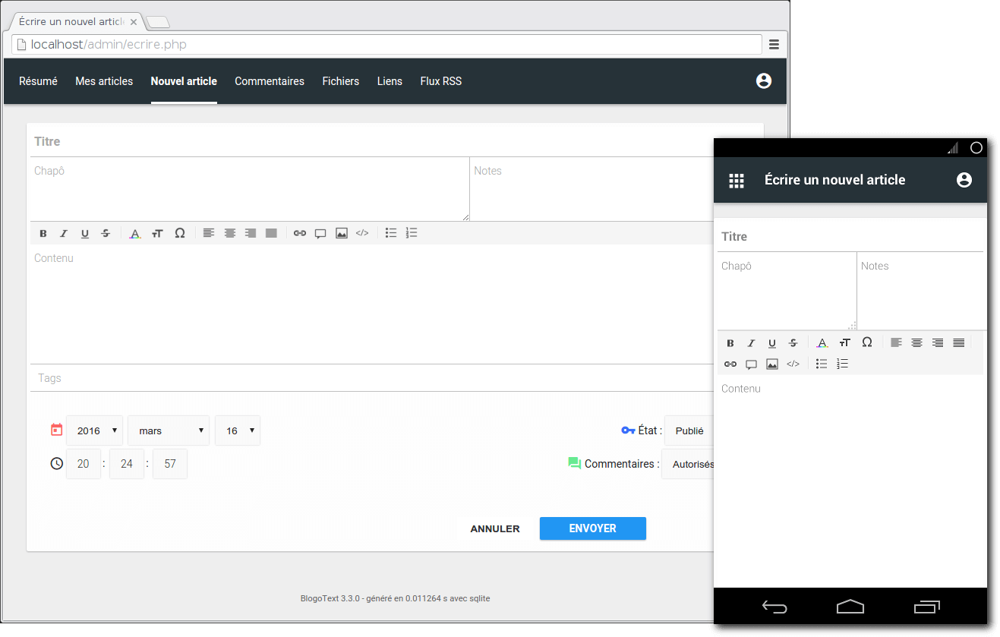

<!--
NB: Deze README is automatisch gegenereerd door <https://github.com/YunoHost/apps/tree/master/tools/readme_generator>
Hij mag NIET handmatig aangepast worden.
-->

# BlogoText voor Yunohost

[](https://ci-apps.yunohost.org/ci/apps/blogotext/)


[](https://install-app.yunohost.org/?app=blogotext)

*[Deze README in een andere taal lezen.](./ALL_README.md)*

> *Met dit pakket kun je BlogoText snel en eenvoudig op een YunoHost-server installeren.*  
> *Als je nog geen YunoHost hebt, lees dan [de installatiehandleiding](https://yunohost.org/install), om te zien hoe je 'm installeert.*

## Overzicht

BlogoText is a lightweight Blog-Engine.

### Features

- Blog with comments and RSS feeds
- Links sharing
- RSS Reader
- Images/Files uploading and sharing
- JSON/ZIP/HTML import-export; WordPress import
- Support Addons


**Geleverde versie:** 3.7.6~ynh7

**Demo:** <https://blogotext.org/blog/>

## Schermafdrukken



## :red_circle: Anti-eigenschappen

- **Upstream not maintained**: This software is not maintained anymore. Expect it to break down over time, be exposed to unfixed security breaches, etc.

## Documentatie en bronnen

- Officiele website van de app: <https://blogotext.org/>
- Officiele beheerdersdocumentatie: <https://github.com/BlogoText/blogotext/wiki>
- Upstream app codedepot: <https://github.com/BlogoText/blogotext>
- YunoHost-store: <https://apps.yunohost.org/app/blogotext>
- Meld een bug: <https://github.com/YunoHost-Apps/blogotext_ynh/issues>

## Ontwikkelaarsinformatie

Stuur je pull request alsjeblieft naar de [`testing`-branch](https://github.com/YunoHost-Apps/blogotext_ynh/tree/testing).

Om de `testing`-branch uit te proberen, ga als volgt te werk:

```bash
sudo yunohost app install https://github.com/YunoHost-Apps/blogotext_ynh/tree/testing --debug
of
sudo yunohost app upgrade blogotext -u https://github.com/YunoHost-Apps/blogotext_ynh/tree/testing --debug
```

**Verdere informatie over app-packaging:** <https://yunohost.org/packaging_apps>
